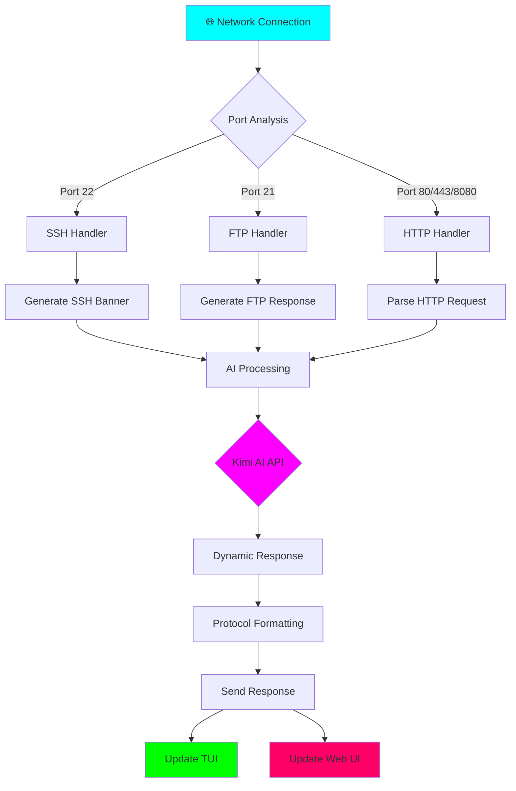
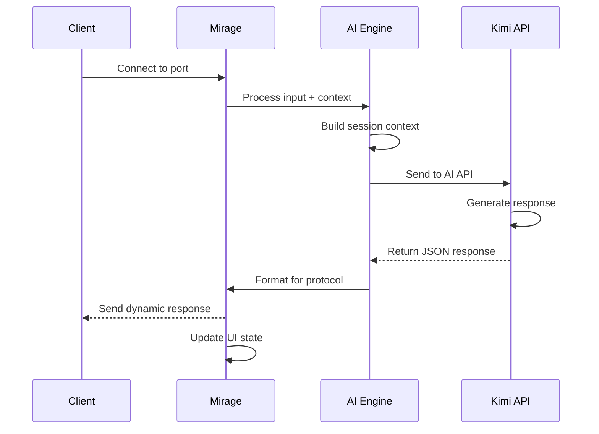
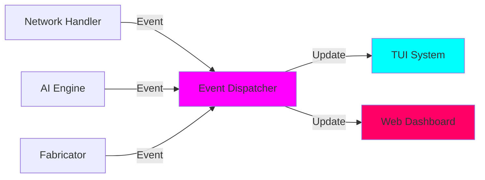

# 🏗️ Mirage V3 Architecture Guide

## System Overview

Mirage V3 employs a **modular, event-driven architecture** that separates concerns between network handling, AI processing, and user interface components.

## 🎯 Core Components

### 1. Network Layer (`handle_client`)
- **Purpose**: Raw TCP connection handling
- **Function**: Bridges network I/O with AI processing
- **Features**: Async I/O, timeout handling, error management

### 2. AI Engine (`MirageAI`)
- **Purpose**: Dynamic response generation using Kimi API
- **Function**: Context analysis and response creation
- **Features**: Protocol awareness, difficulty modes, state management

### 3. Asset Fabricator (`Fabricator`)
- **Purpose**: Generates realistic fake documents and files
- **Function**: Creates Excel budgets, Word documents, file system content
- **Features**: Dynamic generation, contextual relevance

### 4. TUI System (`mirage_v3_cyberpunk.py`)
- **Purpose**: Terminal user interface with cyberpunk aesthetics
- **Function**: Real-time metrics display and event logging
- **Features**: Live updates, color themes, responsive layout

### 5. Web Dashboard (`index.html`)
- **Purpose**: Browser-based monitoring interface
- **Function**: Visual network topology and system status
- **Features**: Multiple views, simulated data, interactive elements

## 🔄 Data Flow Architecture

## 🧠 AI Integration Flow

## 🎨 Event System Architecture

The system uses an **event-driven architecture** where components communicate through structured events:

### Event Types
- `connection`: New network connection established
- `status_update`: System metrics changes (CPU, memory)
- `ai_log`: AI processing activity
- `threat_update`: Security threat level changes
- `error`: System errors and exceptions
- `fab`: Asset generation activity

### Event Flow

## 🔧 Configuration System

### Environment Variables
- `LLM_API_KEY`: Kimi API authentication
- `DIFFICULTY`: Response behavior mode
- `ACTIVE_PORTS`: Network ports to monitor

### Global State (`WORLD_CONTEXT`)
- Network configuration
- User credentials
- File system state
- Web application state

## 📊 Performance Characteristics

### Response Times
- **AI Processing**: ~1-2 seconds average
- **Network I/O**: < 100ms
- **UI Updates**: Real-time (4 FPS)

### Resource Usage
- **Memory**: Efficient circular buffers
- **CPU**: Simulated load, not actual
- **Network**: Async I/O, non-blocking

### Scalability
- **Concurrent Connections**: Limited by system resources
- **State Management**: Fixed-size buffers
- **AI API**: Rate limits apply

## 🛡️ Security Architecture

### Isolation
- **No Real System Access**: All responses are AI-generated
- **Sandboxed Environment**: Self-contained operation
- **Configurable Exposure**: Adjustable difficulty levels

### Safety Features
- **Input Sanitization**: Raw input handling
- **Timeout Protection**: Connection timeouts
- **Error Handling**: Graceful failure modes
- **Audit Logging**: Complete activity tracking

## 🚀 Deployment Architecture

### Single-File Design
- **Monolithic Structure**: All core logic in one file
- **Modular Imports**: Clean separation of concerns
- **Event-Driven**: Loose coupling between components

### Port Requirements
- **Privileged Ports**: 21, 22, 80, 443 (require sudo)
- **Alternative Ports**: 8080 (user-accessible)
- **Async Binding**: Non-blocking port listeners

## 🎯 Use Case Scenarios

### Red Team Training
- Practice against AI-generated targets
- Learn vulnerability patterns
- Test tool effectiveness

### Security Education
- Safe environment for learning
- Realistic attack simulation
- Immediate feedback and logging

### Tool Development
- Test security tools safely
- Validate detection capabilities
- Develop new techniques

---

<h3>🏗️ Architecture Complete</h3>

The cyberpunk matrix is ready for your commands.

