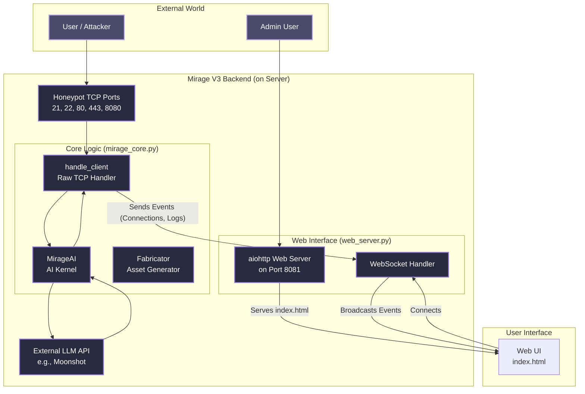

# Mirage V3 Architecture

This document outlines the high-level architecture of the Mirage V3 honeypot system.

## Component Diagram

The diagram below illustrates the flow of data from an external user/attacker through the backend systems and to the front-end user interface.

